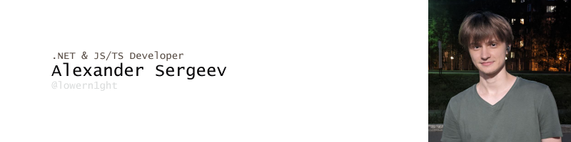

---

## About me

 - Hi, my name is Alexander, specialize on **web application** development, and **microservices** environment.

> Location: `Russia`

---

## Contacts

* [Telegram](https://t.me/lowern1ght)
* Telephone: +7(902)*****80 (Please, contact me in mail or telegram)
* Email: [lowern1ght@yahoo.com](mailto:lowern1ght@yahoo.com)

---

## Skills

* Languages: `C#`, `JavaScript/TypeScript`, `C++(11, 20)`, `Rust`
* Technologies & Frameworks: `.NET Core 3/5/6/7/8`, `.NET Framework`, `.NET Standart 2.0/2.1`, `ASP.NET Core`, `ASP.NET MVC`, 
`Avalonia UI`, `WPF`, `Node.JS`, `React`
  * Libraries: `EF Core/6`, `Linq2DB`, `Dapper`, `Benchmark.NET`, `xUnit`, `Moq/AutoMoq`, `MassTransit`, `MiniProlier`
* Tools: `Jira`, `Confluence`, `TeamCity`, `BitBucket`, `GitLab`, `GitHub`, `Draw.io`, `Postman`
* Operating System: `Windows`, `Linux(Ubuntu/Fedora/CentOS)`
* Databases & Environment: `Postgres`, `MongoDB`, `ClickHouse`, `Redis`, `Kafka`, `RabbitMQ`, `Minio`
* Monitoring & Profiling: `Prometheus`, `Grafana`, `Elasticsearch`, `Kibana`, `Logstash`, `Loki`
* Web/Application Servers: `nginx`, `traefik`, `IIS`, `IIS Express`, `self-hosted`
* Orchestrators & Container Runtime: `Kubernetes`, `Docker Swarm`, `Podman`, `Docker`
* Methodologies: `SCRUM`, `Kanban`, `SOLID`, `Clean Code`, `ACID`, `TDD`, `DDD`

---

## Summary

- **Highly effective web application developer, with a large stack and experience**
- **I specialize in product development and platform development. Excellent at estimating time on task and handling complex situations**
- **Can establish communication with any team and person, able to differentiate and abstract from personality**
- **Excellent with architecture design tools and select good and fast solutions based on needs and time constraints**

---

## Work experience

> 2020 - 2022, Energosfera
>   * Project Role - **Middle** FullStack Developer
>   * About Company  - Largest retail company in the north in Russia
>   * About project/s - Internal CRM for management documents and transport logic
>   * Team size - 1 Project, 1 Tech Lead, 1 Team Lead, 2 - Product Managers, 8 - Developers

 * #### Task performed:
    - Networking and reverse proxy configuration.
    - Development product features in legacy modules.
    - CI/CD customization and support for your projects.
    - Work with retail devices KKM, Terminal, Cash system.
    - Developing and updating internal desktop applications.
    - Introduction of new functions compliant with legislation.
    - Architectural planning and development of projects such as **Bonus system**, **Cash modules**, **Document Routing**.

 * #### Company stack: 
   - `C#`, `.NET Core`, `.NET Framework`, `Dapper`, `EFCore`, `JS/TS`, `React`, `Electron.JS`, `Docker`, `Prometheus/Grafana`, 
`Zabbix`, `PostgreSQL`, `Redis`,`RabbitMq`, `Elasticsearch`, `Kibana`

---

> 2022 - **For now**, Hybrid.ai
>   * Project Role - **Lead Senior Backend Developer**, **System Architect**
>   * About Company  - Marketing company, ranked 3rd in the world. Provides a complete package of necessary for opening and advertising on sites
>   * About project/s - CRM, DSP, SSP, Big Data statistic, more feature for marketing life, integration with popular solutions and advertising world supplier
>   * Team size - 1 Project, 4 Team Lead, 1 - System Architect, 8 - Product Managers, 16 - Backend, 14 - Frontend

* #### Task performed:
    - Planning the architecture of highly loaded solutions.
    - Development and implementation of new product features.
    - Selecting and advocating technologies for new products.
    - Direct involvement in decisions important for the product.
    - Development of features for processing large amounts of data.
    - Providing the product to the customer, developing presentations.
    - Conducting a code review highlighting common code style and approaches.
    - Architecture planning for third-party projects, preparation of MVP solution.
    - Optimization of work with the database, ensuring fault tolerance of existing tools.
    - Manage a team of 4 people refactoring and splitting the monolith into microservices.
    - Support and fix legacy code with optimization of existing solutions in a constrained environment.
    - Setting up a ready-made production and development environment on **kubernetes** for new projects with **monitoring**

* #### Company stack:
    - `C#`, `.NET Core`, `.NET Framework`, `Dapper`, `EFCore`, `Linq2Db`, `EFCore`, `MassTransit`,
      `Kafka`, `Redis`, `RabbitMQ`, `JS/TS`, `xUnit`, `MSUnit`, `Benchmark.NET`,
      `React`, `Docker`, `Kubernetes`, `Nginx`, `IIS`, `JMeter`, `Ansible`, `Loki`, `Proxmox`, `Amazon S3`, `Minio`, 
      `Prometheus/Grafana`, `Zabbix`, `PostgreSQL`, `RabbitMq`, `MongoDB` `Kafka`, `Elasticsearch`, `Kibana`

---

#### Education

> Nefteugansk's Technology College
>   * Faculty - Production