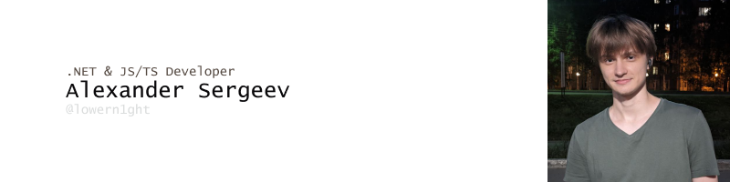

> ### **Lead Backend Engineer · System Architect · AI / Agentic Systems**

---

## About me

 - Hi, my name is Alexander, specialize on **web application** development and **microservices** environment.
 - For the last years focused on **AI-assisted & agentic engineering**: building agent orchestration on top of LLMs and bringing agent-oriented development to long-lived production systems.

> Location: `Russia`

---

## Contacts

* [GitHub](https://github.com/lowern1ght)
* [Telegram](https://t.me/lowern1ght)
* Telephone: +7(902)*****80 (Please, contact me in mail or telegram)
* Email: [lowern1ght@yahoo.com](mailto:lowern1ght@yahoo.com)

---

## Skills

* Languages: `C#`, `JavaScript/TypeScript`, `C++(11, 20)`, `Rust`
* AI & Agents: `LLM orchestration`, `Claude`, `agentic workflows`, `multi-agent systems`, `MCP`, `RAG`, `prompt engineering`, `self-verifying agent pipelines`
* Code Quality & Static Analysis: `custom Roslyn analyzers`, `Roslyn`, `.editorconfig`, `analyzer rule sets`, `code style enforcement`
* Technologies & Frameworks: `.NET Core 3/5/6/7/8`, `.NET Framework`, `.NET Standard 2.0/2.1`, `ASP.NET Core`, `ASP.NET MVC`, 
`Avalonia UI`, `WPF`, `Node.JS`, `Bun`, `React`
  * Libraries: `EF Core/6`, `Linq2DB`, `Dapper`, `Benchmark.NET`, `xUnit`, `Moq/AutoMoq`, `MassTransit`, `MiniProfiler`
* Tools: `Jira`, `Confluence`, `TeamCity`, `BitBucket`, `GitLab`, `GitHub`, `Draw.io`, `Postman`
* Operating System: `Windows`, `Linux(Ubuntu/Fedora/CentOS)`
* Messaging & Streaming: `Kafka` (native client; consumer groups, partition replication, retention log), `RabbitMQ`, `MassTransit`
* Databases & Environment: `Postgres`, `MongoDB`, `ClickHouse`, `Redis`, `Minio`
* Monitoring & Profiling: `Prometheus`, `Grafana`, `VictoriaMetrics`, `Elasticsearch`, `Kibana`, `Logstash`, `Loki`
* Web/Application Servers: `nginx`, `traefik`, `IIS`, `IIS Express`, `self-hosted`
* Orchestrators & Container Runtime: `Kubernetes`, `Docker Swarm`, `Podman`, `Docker`
* Methodologies: `SCRUM`, `Kanban`, `SOLID`, `Clean Code`, `ACID`, `TDD`, `DDD`

---

## Summary

- **Highly effective web application developer, with a large stack and experience**
- **I specialize in product development and platform development. Excellent at estimating time on task and handling complex situations**
- **Can establish communication with any team and person, able to differentiate and abstract from personality**
- **Excellent with architecture design tools and select good and fast solutions based on needs and time constraints**
- **Designing and building agentic systems: in-house orchestration that turns Jira tasks into code with self-review loops, and bringing AI-assisted development into a production team**
- **High bar for code quality: enforce style and architecture through custom Roslyn analyzers, `.editorconfig` and rule sets, so AI-generated code stays clean, consistent and review-ready**

---

## Work experience

> 2020 - 2021, Energosfera
>   * Project Role - **Middle** FullStack Developer
>   * About Company  - Largest retail company in the north in Russia
>   * About project/s - Internal CRM for management documents and transport logic
>   * Team size - 1 Project, 1 Tech Lead, 1 Team Lead, 2 - Product Managers, 8 - Developers

 * #### Task performed:
    - Networking and reverse proxy configuration.
    - Development product features in legacy modules.
    - CI/CD customization and support for your projects.
    - Work with retail devices KKM, Terminal, Cash system.
    - Developing and updating internal desktop applications.
    - Introduction of new functions compliant with legislation.
    - Architectural planning and development of projects such as **Bonus system**, **Cash modules**, **Document Routing**.

 * #### Company stack: 
   - `C#`, `.NET Core`, `.NET Framework`, `Dapper`, `EFCore`, `JS/TS`, `React`, `Electron.JS`, `Docker`, `Prometheus/Grafana`, 
`Zabbix`, `PostgreSQL`, `Redis`, `RabbitMQ`, `Elasticsearch`, `Kibana`

---

> 2021 - 2022, Meridian Payments
>   * Project Role - **Senior Backend Developer**
>   * About Company  - Fintech startup building a card-not-present payment gateway and billing platform
>   * About project/s - Payment processing, recurring billing, fraud detection and acquiring integrations
>   * Team size - 1 Tech Lead, 2 Product Managers, 6 Backend, 2 Frontend, 1 DevOps

* #### Task performed:
    - Designed and built the **core payment gateway** (.NET Core, PostgreSQL) processing card-not-present transactions with idempotency keys and exactly-once delivery semantics.
    - Implemented a **real-time anti-fraud pipeline** (Kafka, Redis) — heuristics + velocity rules that cut chargeback rate significantly within the first quarter.
    - Built the **recurring billing engine** handling subscriptions, proration and dunning flows for SaaS merchants.
    - Integrated with **external acquirers and PSPs** (3-D Secure, tokenization, webhooks) — standardized adapter layer so new providers shipped in days, not weeks.
    - Owned **PCI DSS compliance** for the backend layer — no plain PAN storage, strict key management, audit-ready logging.
    - Shipped services on **Kubernetes** with full **OpenTelemetry** tracing and Prometheus metrics.

* #### Company stack:
    - `C#`, `.NET Core`, `EF Core`, `PostgreSQL`, `Kafka`, `Redis`, `Docker`, `Kubernetes`, `Prometheus/Grafana`, `OpenTelemetry`, `xUnit`

---

> 2022 - **For now**, Hybrid.ai
>   * Project Role - **Lead Senior Backend Developer**, **System Architect**
>   * About Company  - Marketing company, ranked 3rd in the world. Provides a complete package of necessary for opening and advertising on sites
>   * About project/s - CRM, DSP, SSP, Big Data statistic, more feature for marketing life, integration with popular solutions and advertising world supplier
>   * Team size - 1 Project, 4 Team Lead, 1 - System Architect, 8 - Product Managers, 16 - Backend, 14 - Frontend

* #### Task performed:
    - Designed an **in-house agentic orchestrator**: pulls tasks from **Jira**, generates and edits code with **self-verification** loops, and **estimates the dollar cost of a feature** before work begins.
    - **Decomposed a massive legacy product into a modular core + BFF (Backend-for-Frontend) system** and enabled **agent-oriented development** on the 7-year-old core monolith — product teams now extend it through **Claude Code**, while engineering owns the surrounding fleet of **20–30 microservices**.
    - Architected the product around **deep DDD with a plugin system**: clear domain boundaries and extension points that keep a long-lived monolith maintainable.
    - Designed and maintained the **internal shared libraries** consumed by all products and microservices — common abstractions, conventions and building blocks that standardize how every team builds across the platform.
    - Designed and built **custom DSL parsers** with a query language — letting product teams express filtering, rules and complex domain queries declaratively instead of through ad-hoc code paths.
    - Built a **notification service handling 50k rps** at the initial stage, with horizontal scaling headroom.
    - Introduced **AI-assisted development** (Claude → in-house `pi-coding`) into the team's day-to-day delivery, backed by **guardrails for agent-generated code** — custom **Roslyn analyzers**, strict `.editorconfig`, rule sets, and an **agent-driven verification harness** on my own `hermes` agent, with self-verifying feedback loops for both AI and human authors.
    - Built an internal **job orchestration & monitoring system**: cron-scheduled jobs with a web **UI** and **Keycloak**-based auth.
    - Owned **product telemetry** and observability — custom **dashboards in Kibana and Grafana**, stood up **VictoriaMetrics** and **Elastic** stacks for testing and diagnostics.
    - Introduced an **exception inheritance hierarchy** splitting **business vs technical** errors, so support captures maximum diagnostics per issue and bugs reach developers far faster.
    - Managed a **team of 4** refactoring legacy modules and extracting satellite microservices around the core monolith.
    - Set up ready-made production and development environments on **Kubernetes** for new projects with **monitoring**.

* #### Company stack:
    - `C#`, `.NET Core`, `.NET Framework`, `Dapper`, `EFCore`, `Linq2Db`, `MassTransit`,
      `Kafka`, `Redis`, `RabbitMQ`, `JS/TS`, `xUnit`, `MSUnit`, `Benchmark.NET`,
      `React`, `Docker`, `Kubernetes`, `Nginx`, `IIS`, `JMeter`, `Ansible`, `Loki`, `Proxmox`, `Amazon S3`, `Minio`, 
      `Prometheus/Grafana`, `VictoriaMetrics`, `Zabbix`, `PostgreSQL`, `MongoDB`, `Elasticsearch`, `Kibana`, `Keycloak`,
      `Claude / LLM`, `MCP`, `agentic orchestration`, `Bun`, `TypeScript`

---

## Projects

* [**pi-soly**](https://github.com/lowern1ght/pi-soly) — *open source* — my own opinionated, agent-oriented project-management framework (companion to a coding agent).
  Built in `TypeScript` on the `Bun` runtime, shipped as an npm package.
  * Workflow engine with `/plan`, `/execute`, `/resume`, `/inspect` slash commands and a GSD-inspired planning cycle with persistent, git-friendly Markdown state.
  * Multi-agent **rotor switcher** to hot-swap between specialized agents (worker, oracle, scout, …), live in-turn task list, and a tabbed multi-question picker tool.
  * Zero-config install — bundles planning, task management and agent switching into a single dependency.

* [**notifliwy**](https://github.com/dot-stbl/notifliwy) — *open source* — my own **.NET library**: a distributed handler & pipeline for **notifications**, built for event-driven architectures with a fluent builder API. Published under my org [dot-stbl](https://github.com/dot-stbl).
  * Composable processing pipeline (input → connector → conditions → mapper → exporter), fully async with **DI** integration.
  * Pluggable transport providers (**Kafka** / **MassTransit**), built-in metrics and **OpenTelemetry** diagnostics.

* **Real-time crypto analytics & trading platform** — *private, self-hosted* — a personal platform that ingests and processes **~150k events/sec from 18 exchanges** and exposes unified market analysis and automated trading.
  * High-throughput event pipeline with low-latency aggregation across heterogeneous exchange feeds.
  * Source kept in a self-hosted Git; not public — details and walkthrough available on request.

* **Self-hosted home ecosystem** — *private* — a suite of personal services and automation I design, build and run on my own infrastructure.

---

## Education

> Nefteugansk's Technology College
>   * Faculty - Production