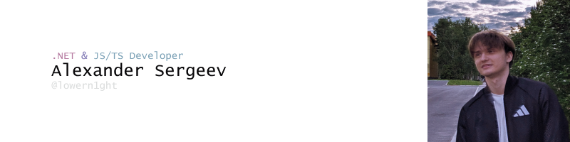

---

## - Who went and how

 - Hi, my name is Sasha😊, I specialize in web application development. I've been interested in programming since I was 12. 
I started with website development, freelancing from the age of 17.
 - Quite sociable, very capable guy, really learning fast...🐱‍👤
 - I am fond of artificial intelligence, machine learning, automation of everyday life. I read a lot of technical literature, 
look through conferences and work out in practice. Here it is necessary to tell a little more about my feature. 
I believe that the fastest way, but also the most difficult way of 
learning is learning by practice, so. 
I spend most of my time practicing and consolidating ready-made skills

> In general, I like to coding and live by it

 - I have been doing 3D and 2D graphics for more than 6 years
     * **Blender**, 3D Max, Maya
     * **Substance Painter**, Mixer/Bridge
     * **Marvelous Designer**
     * **Photoshop**, **Figma**, **Illustrator**

## - Skills and experience

* **Jira**, **Confluence**, **Notion**
  * Work with task tracking in Jira, record documentation in the Confluence

* **.NET**, **C#**, **ASP NET**, **EntityFramework**, **Dapper**
  * I have been writing in c# for more than 4 years.
  There are a lot of web applications written in ASP, a lot of experience working with 
  **MSDI** and **AutoFac** IoT containers.
  * Work with **asynchronous**, **parallelism**, 
  * Development of authorization using `ASP Identity`

* **JS/TS**, **Node.js**, **React**, **Ant Design**, **BlueprintJS**
  * As I wrote earlier, I have been doing frontend development since childhood,
  I started doing Node.js and react in depth a year ago.
  Have little experience writing client-side in Angular, Vue

* **GitLab**, **TeamCity**
  * Writing build configurations, customizing agents, working with parameters

* **Docker**, **Redis**, **PostgreSQL**, **SQLite**, **ElasticStack**, **MongoDB**, **ClickHouse**
  * I've been in deploy for about a year, I feel very comfortable in unix, windows.
  * Using ClickHouse for statistics, working with state aggregation
  Set up integration of microservice and narrowly focused corporate applications

* **Minio**, **AWS Accepted**
  * Working with s3 storage, deployment and connectivity

* **Kafka**, **RabbitMQ**
  * Working with brokers using roaming, integration via `MassTransit` and common clients

* **Prometheus**, **Grafana**, **Zabbix**
  * Setting up logging and metrics accounting with the above systems, indexing implementation, healthcheck setup

* **System Design**, **OOP**, **SOLID**, **Design Patterns**, **DDD**, **CQRS**
  * Developed and designed systems with Clean Architecture and DDD application. I have also designed and have experience 
  working with microservice architecture, I am familiar with most design patterns

* **Unit tests**, **E2E**, **Integration tests**
  * I have experience writing unit tests on **xUnit**, **gtest**. Evaluation of module performance via **Benchmark.NET**. 
  Wrote **integration** and **e2e** tests, wrote according to the **TDD** method, **Moq**

* **Windows**, **Linux**
  * Comfortable on all major OS, I've been configuring and messing around with Linux for over 4 years. 
  * Configured a home server to use the

### - Secondary study

 - I have loved **cpp** very much since I was 16, and I am still fond of low-level languages. Recently I started to study **Rust**.
He wrote mini utilities for unix systems, **high-performance** parsers, **voice assistants**
 - I love games insanely, from the side of the idea. I love making games. I work a lot in **UE4**, 
recently switched to **UE5**

* **CPP**(11, 14, **17**),
    * **boost**
    * **SDL2**
* vcpkg, **conan**
* **Cmake**

## - Work experience

  <strong>Energosfera</strong>

> 2021 - 2023

- Independent project management
- Successful application development on .NET, 1C
- Development of services and a monolithic web application on ASP.NET Core
- Integration of solutions for working with commercial equipment
- Participation in the planning of architectural solutions
- Code analysis and refactoring

    
    <strong>Hybrid</strong> <a style="font-size: 12px">hybrid.ai</a>

> 2023 - For now

- Bug fixes
- Development and design of reporting, notification service, statistics
- Global migration of monolith from .net framework to .net 8 with further refactoring and breakdown into services
- Documentation and deployment of internal libraries and services
- Work with testing services, migration of old ones, development of new ones
- Authorization refactoring and implementation of new features
- Universalization by means of reflection and the development of a tree
- Development of web-api for interaction with the front end
- Writing benchmark, unit tests
- Planner infrastructure design and development, ui design, frontend ui development
- Fixing nightly releases)

---

## - Pet projects

1. [**OpenTrader**](https://github.com/lowern1ght/OpenTrader) - is an advanced cryptocurrency trader bot based on microservice architecture. 
   It is a powerful solution that utilizes a wide range of advanced technologies...

---

2. [**Garther**](https://github.com/lowern1ght/Garther) - an open project on a production-ready forum engine on 
    a microservice architecture using the DDD, 12FA approach

---

3. [**Otto**](https://github.com/lowern1ght/Otto) - Microservice weather checker web application on docker with 
   a web interface on React, 
   according to the 12FA approach

---

4. [Sharee](https://github.com/lowern1ght/Sharee) - a commercial web server for exchanging local changes for an internal relational database with its
   own authorization on tokens and the interface on RazorPages

---

5. [AlercroyBot](https://github.com/lowern1ght/AlercroyBot) - my open source template project for telegram bot with quick
   command settings when launching the application with documentation

## - Educations

* **Quantorium** — **2011 - 2016**
   - Graduated from the school of additional education in the IT, Hi Tech division 

* **Secondary Special Education** — **2018 - 2023**
  - Graduated with honors from the Polytechnic College

---

### - Contacts

[lowern1ght@yahoo.com](mailto:lowern1ght@yahoo.com) ⁕ +7(902)8535680 ⁕ [telegram](https://t.me/lowern1ght) ⁕ [CodeWars](https://www.codewars.com/users/lowern1ght)